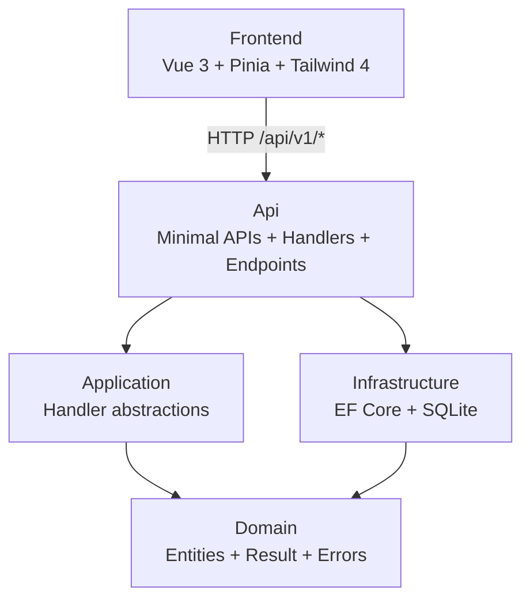

# Tasklist

A small task management application, REST API plus single-page web client.

## TL;DR

Take-home assessment for Lateral Group. The brief asked for a REST API that lists, creates, toggles, and deletes tasks plus a component-based UI. I treated it as a production-quality demonstration, matching the recruiter's framing.

Stack: .NET 10 Minimal APIs over Clean Architecture + Vertical Slice Architecture, EF Core 10 against SQLite, and a Vue 3 single-page client with Pinia, vee-validate + zod, and TailwindCSS 4. REST level 3 with HATEOAS links, RFC 7807 ProblemDetails for errors, and a manual snapshot-and-restore optimistic UI for toggle and delete. Duplicate titles are rejected with 409 Conflict, validation errors show inline as a `FieldError` component, system events appear as top-right toasts with pause-on-hover and a progress bar.

41 backend tests (domain unit, handler integration, endpoint integration, architecture) and 36 frontend tests (form rules, store outcomes, container view-state, modal behaviour, toast lifecycle, sort) all pass on a clean clone.

## Tech stack

- **Runtime**: .NET 10, C# 14, Node.js 24 LTS
- **API**: ASP.NET Core Minimal APIs + Scalar OpenAPI viewer
- **Data**: EF Core 10 with SQLite (in-process file `tasklist.db`), fixed seed of 10 realistic tasks (3 pre-completed)
- **Validation**: FluentValidation at the API boundary, Ardalis.GuardClauses for domain invariants
- **Cross-cutting**: Serilog structured logs, `IExceptionHandler` global error mapping, `/health/live` and `/health/ready` health probes
- **Frontend**: Vue 3.5 (`<script setup>`), Pinia, vee-validate + zod, TailwindCSS 4 with semantic tokens, class-variance-authority for Button variants, Headless UI (Dialog + Listbox), @lucide/vue icons, VueUse
- **Testing**: xUnit v3 + Shouldly + NetArchTest on the backend; Vitest + Testing Library Vue + user-event + MSW + jest-axe on the frontend

## Prerequisites

- [.NET 10 SDK 10.0.300 or newer](https://dotnet.microsoft.com/download/dotnet/10.0). Verify with `dotnet --version`.
- [Node.js 24 LTS](https://nodejs.org/). `node -v` should report `v24.x`. The frontend includes a `.nvmrc` so `nvm use` picks the right version.
- Git

## Quick start

You will need two terminals, one for the backend and one for the frontend.

**Terminal 1, backend:**

```bash
git clone <repo-url> tasks
cd tasks
dotnet run --project src/TaskList.Api
```

Wait for the log line confirming the API is listening on `http://localhost:5113`. Migrations and the seeder run automatically on startup, so the database starts with 10 example tasks.

**Terminal 2, frontend:**

```bash
cd frontend
npm ci
npm run dev
```

The dev server starts on `http://localhost:5173` and proxies `/api/*` to the backend, so no CORS configuration is needed in development.

**Verify it works:**

1. Open `http://localhost:5173` in your browser. The list should show 10 seeded tasks.
2. Open `http://localhost:5113/scalar/v1` for interactive API documentation with every endpoint.
3. Create a task in the UI, toggle it, and delete it. All three actions should round-trip successfully.

## Running from an IDE

The two halves of the stack run in different tools. Pick the workflow that matches your editor.

**Backend** — Visual Studio 2022/2026, Rider, or VS Code:

- Open `TaskList.slnx` at the repository root (`.slnx` is the modern XML solution format and is supported by all three IDEs).
- Set `TaskList.Api` as the startup project and press F5 (Run/Debug).
- Migrations and the seeder run inside `Program.cs`, so the SQLite file is created and populated on first launch.

**Frontend** — Vue does not run inside Visual Studio. Use VS Code (or any editor) plus a terminal:

```bash
cd frontend
npm ci
npm run dev
```

Rider users can drive the same scripts from the npm tool window. The frontend is a separate Vite dev server on `http://localhost:5173` that proxies `/api/*` to the backend on `http://localhost:5113`; both processes must be running for the full app to work.

## How to run tests

Backend, from the repository root:

```bash
dotnet test
```

Expected: **41 tests passing** across three projects.

- `TaskList.UnitTests` (13): domain entity invariants on `TaskItem` and `Result<T>` shape contracts. Pure logic, no I/O, all under a second.
- `TaskList.IntegrationTests` (19): handlers run against SQLite in-memory under `Features/`, endpoints run through `WebApplicationFactory<Program>` under `Endpoints/`. Includes the duplicate-title 409 path at both layers.
- `TaskList.ArchitectureTests` (9): dependency direction (Domain has no inward edges), naming conventions (`Handler` / `Endpoint` / `Validator` suffixes), and HATEOAS response shape (every response DTO exposes a `Links` property typed `IReadOnlyList<LinkResponse>`).

Frontend, from `frontend/`:

```bash
npm run test:unit
```

Expected: **36 tests passing** across six files.

- `tests/stores/tasks.store.spec.ts` (12): load/toggle/delete optimistic outcomes, error rollback, search filter, four sort options, the new 409-duplicate `field-error` outcome shape.
- `tests/components/CreateTaskForm.spec.ts` (7): submit-only-then-live validation timing, server 422 inline mapping, server 409 inline + input preservation, the char counter warning state past 180.
- `tests/components/Toast.spec.ts` (5): semantic `role="status"` / `role="alert"`, hover-pauses-auto-dismiss with fake rAF, click-to-dismiss, and the race test that proves the rAF loop survives `create → dismiss → create`.
- `tests/components/TaskList.spec.ts` (5): the four view-state branches (loading, error, empty, success) plus one jest-axe pass over the integrated tree.
- `tests/components/ConfirmDeleteModal.spec.ts` (4): dialog renders with the task title, Delete emits `confirm`, Cancel emits `cancel`-only, Escape emits `cancel`-only.
- `tests/components/TaskItem.spec.ts` (3): event emission, HATEOAS-driven disabling, modal-confirm round-trip.

## API documentation

- **Scalar UI**: <http://localhost:5113/scalar/v1>
- **OpenAPI document**: <http://localhost:5113/openapi/v1.json>

Task endpoints:

| Method | Route | Purpose |
|---|---|---|
| `POST` | `/api/v1/tasks` | Create. 201 + Location header. 422 on validation, 409 on duplicate title. |
| `GET` | `/api/v1/tasks` | List. 200 + `{ data, count, links }`. |
| `GET` | `/api/v1/tasks/{id}` | Read one. 200 or 404. |
| `POST` | `/api/v1/tasks/{id}/toggle` | Flip completion. 200 or 404. |
| `DELETE` | `/api/v1/tasks/{id}` | Delete. 204 or 404. |

Health endpoints (no auth, useful for orchestration probes):

| Method | Route | Returns |
|---|---|---|
| `GET` | `/health/live` | 200 if the process is alive. No dependency checks. |
| `GET` | `/health/ready` | 200 if SQLite is reachable, 503 otherwise. |

Example, create a task:

```bash
curl -X POST http://localhost:5113/api/v1/tasks \
  -H "Content-Type: application/json" \
  -d '{"title": "Buy groceries"}'
```

The response body includes a `links` array with the `self`, `toggle`, and `delete` HATEOAS relations available for that task. The frontend uses those relations to enable or disable per-row actions, so action availability is contract-driven.

## Architecture overview



The dependency rule lives in the project graph: every arrow points inward toward `Domain`, and the `Domain` project has no project references of its own. `tests/TaskList.ArchitectureTests/DependencyRulesTests.cs` asserts the rule structurally, so a contributor cannot accidentally introduce a backwards edge without the build failing.

Handlers and endpoints live together inside `TaskList.Api/Features/` as vertical slices, one folder per use case with `Endpoint.cs`, `Handler.cs`, `Validator.cs`, and `Models.cs`. The `Application` project holds only the `ICommandHandler<,>` and `IQueryHandler<,>` abstractions. Splitting handlers into a parallel tree under the Application project adds navigation cost without architectural benefit at this scope.

## Architecture decisions at a glance

| Decision | Why | Trade-off |
|---|---|---|
| EF Core direct, no Repository wrapper | `DbContext` is already a Unit of Work and `DbSet<T>` already exposes repository semantics | Handlers query EF directly; cannot swap providers without touching them |
| Custom `ICommandHandler<,>` / `IQueryHandler<,>`, no MediatR | MediatR's post-v13 license is commercial; the contracts I need are 4 lines | No built-in pipeline behaviours; would add a decorator if cross-cutting concerns grow |
| Pinia store, not Vue Query | Five endpoints, no cross-route cache, no background refetch — Vue Query would solve problems I do not have | Manual snapshot-and-restore for optimistic UI; would refactor to Vue Query past ~8 endpoints |
| `Result<T>` for expected failures, exceptions for the unexpected | Validation, not-found, conflict are normal flow; exceptions are noisy and slow for that | `IsFailure` branch on every call site instead of `try/catch` |
| Duplicate-title check in memory over a projected title list | Analyzer-clean (`OrdinalIgnoreCase`), locale-stable, bounded domain | Loads every title per create — fine at dozens of tasks, moves to SQL past the pagination threshold |
| No pagination — list returns all tasks | Personal task list is bounded; pagination is structural complexity the brief does not warrant | Explicit migration trigger documented in "What I would do with more time" |

## Key decisions and trade-offs

- **REST level 3 with HATEOAS, not just level 2.** The brief asked for production-quality work. Level 3 is what Roy Fielding's dissertation calls truly RESTful; earlier levels are HTTP-shaped RPC. The marginal cost was small: `LinkGenerator` is built into ASP.NET Core, `.WithName()` was already mandatory for OpenAPI metadata, and `TaskItem.vue` reads `task.links` to enable or disable actions, so action availability is contract-driven instead of hard-coded. Trade-off: payload size grows by a few bytes per task, and the client wraps every action button in a links check.
- **Clean Architecture + VSA, not VSA-only.** The four projects make the dependency rule structural: `Domain` cannot reference EF Core because the package is not in its csproj. The extra file count is the price for architecture tests that enforce dependency direction at the assembly boundary.
- **Pinia store, not Vue Query, for server state.** With five endpoints, no cross-route cache, and no background refetch needs, Vue Query would add a library for state I do not need at this scope. The store uses a manual snapshot pattern: before each mutation it captures the current tasks array, applies the change locally, calls the API, then either replaces the entry with the server response on success or restores the snapshot on failure. The same store now also tracks a `pendingIds` set so `TaskItem` can dim and disable the row while a toggle or delete is in flight. What I gave up: when the API grows to eight or more endpoints, this pattern starts repeating and Vue Query becomes the right call.
- **`create()` returns a discriminated `Result`, not exceptions.** The other store actions (`list`, `toggle`, `remove`) already mirrored the api-client's `{ kind: 'ok' | 'error' }` shape; `create()` was the lone outlier that threw `TaskValidationError`. Aligning it to `{ kind: 'ok' | 'field-error' | 'failure' }` removed the path where a 5xx silently ran the form's success branch and reset the user's typed draft. Validation (422) and the new duplicate-title (409) both map to `field-error` and render inline through `FieldError`; system failures become top-right toasts and leave the input untouched.
- **Duplicate-title check runs in memory over a projected title list.** The handler does `db.Tasks.Select(t => t.Title).ToListAsync()` then compares with `string.Equals(t.Trim(), normalized, StringComparison.OrdinalIgnoreCase)`. Pushing the comparison into SQL means `LOWER()`/`TRIM()` translations the project's analyzers reject without an explicit `CultureInfo`, and SQLite's `NOCASE` collation is ASCII-only anyway. At dozens of tasks the in-memory pass is invisible; past the same volume threshold as pagination it migrates to a unique index. Trade-off: one extra round-trip column on every create.
- **Brace and line-length conventions enforced by `.editorconfig`.** `csharp_prefer_braces = false:suggestion` means single-statement bodies omit braces (guard-clause idiom), multi-line bodies keep them. `max_line_length = 150` keeps fluent EF queries and `handler.HandleAsync(..., CancellationToken)` test calls on one logical line. Both are tooled, not stylistic; `dotnet format --verify-no-changes` would catch drift.
- **Scalar over Swashbuckle, plus built-in health checks.** Scalar serves the OpenAPI contract as a browsable UI at `/scalar/v1` with one package, replacing heavier Swashbuckle. `/health/live` and `/health/ready` are three lines of built-in ASP.NET Core. Both are baseline for a deployable API, not extras. Trade-off: one dependency, two routes.
- **Container test over leaf tests.** `TaskList.spec.ts` drives the four view-state branches (loading, error, empty, success) by setting Pinia initial state and asserting the right child renders, with one jest-axe call on the integrated tree. There is no `EmptyState.spec.ts` or `LoadingState.spec.ts` because those components are pure presentation and have no behaviour worth testing in isolation. The same rule lets `FieldError` ship without a dedicated spec — its accessibility contract (`role="alert"`) is exercised through the `CreateTaskForm` 422 and 409 tests. Trade-off: lower per-file line coverage on the leaves, accepted because the leaves have no branches to cover.
- **Semantic CSS tokens, not raw Tailwind shades.** Components reference `bg-surface`, `text-foreground`, `border-border`, `text-danger`, `text-warning` instead of `bg-slate-900` or `text-amber-700`. The mapping lives in a single `@theme` block in `src/styles.css`, with a `.dark` override layer. Adding a brand color or flipping the palette is one diff in one file. The cost: contributors editing styles need to learn the token map before changing colors.

## Project structure

```
TaskList.slnx
src/
  TaskList.Api/                     Minimal APIs, Scalar UI, Program.cs, middleware
    Features/Tasks/{CreateTask,ListTasks,GetTaskById,ToggleTask,DeleteTask}/
                                    One folder per use case: Endpoint, Handler, Validator, Models
    Features/Tasks/Mapping/         LinkResponse + TaskResponse + TaskLinks builder
    Common/                         Routes, RouteNames, GlobalExceptionHandler, ResultExtensions
  TaskList.Application/             ICommandHandler<,> and IQueryHandler<,> abstractions
  TaskList.Domain/                  Entities, Result<T>, DomainError, ErrorType, strongly typed TaskId
  TaskList.Infrastructure/          AppDbContext, EF configurations, migrations, fixed-list TaskSeeder
tests/
  TaskList.UnitTests/Domain/        Pure-logic tests against the Domain project only
  TaskList.IntegrationTests/
    Features/                       Handler tests against real SQLite in-memory
    Endpoints/                      WebApplicationFactory<Program> HTTP exercises
    Fixtures/                       TestDb, TaskFaker (Bogus, tests-only), TaskApiFactory
  TaskList.ArchitectureTests/       NetArchTest rules: dependency direction, naming, response shape
frontend/
  src/
    features/tasks/                 Components, composables, store, schemas, types (vertical slice)
    shared/ui/                      Button (CVA), Input, Checkbox, Toast, FieldError
    shared/lib/                     cn, api-client, problem-details parser
    composables/                    useToast, useTheme
    App.vue, main.ts, styles.css    Root, mount, semantic tokens + dark theme
  tests/                            Vitest + Testing Library Vue + MSW + jest-axe
```

## Troubleshooting

**Backend port already in use.** Override via the environment variable:

```bash
ASPNETCORE_URLS="http://localhost:5180" dotnet run --project src/TaskList.Api
```

Update `frontend/vite.config.ts` `server.proxy.target` to match if you do this.

**HTTPS dev certificate not trusted.** The default profile runs HTTP, so this is only relevant if you switch to the `https` launch profile:

```bash
dotnet dev-certs https --trust
```

On Linux the trust step needs additional setup. See <https://aka.ms/dev-certs-trust>.

**SQLite database file locked.** Delete `src/TaskList.Api/tasklist.db` (plus any `-shm` or `-wal` siblings) and restart the API. The migration and seeder recreate it on next boot.

**Seeded tasks differ from the documented examples after pulling.** Delete `src/TaskList.Api/tasklist.db` and restart. The seeder only runs against an empty database, so existing rows from a prior run are left as-is.

**Migrations did not run on startup.** They run inside `Program.cs` via `MigrateAsync`. If you ever need to apply them manually:

```bash
dotnet ef database update \
  --project src/TaskList.Infrastructure \
  --startup-project src/TaskList.Api
```

`dotnet-ef` is registered as a local tool. Run `dotnet tool restore` first if the command is missing.

**Wrong .NET SDK version.** `dotnet --version` must report `10.0.300` or newer. `global.json` pins the floor and rolls forward to the latest feature band. Install from <https://dotnet.microsoft.com/download/dotnet/10.0>.

**Wrong Node version.** `node -v` must report `v24.x`. With nvm or fnm installed, `cd frontend && nvm use` (or `fnm use`) picks the right one from `.nvmrc`. Without a version manager, install Node 24 LTS from <https://nodejs.org>.

## What I would do with more time

1. **CI pipeline** as a GitHub Actions workflow: `dotnet format --verify-no-changes`, `dotnet test`, `npm ci && npm run build && npm run test:unit`, plus an axe smoke pass over the rendered SPA. Today these run locally; in a team setting they belong on every push.
2. **Observability.** OpenTelemetry tracing on the backend with the `traceId` already present in `ProblemDetails` flowing into spans, plus Sentry on the frontend for runtime errors. The hook is already there in the error envelope — what's missing is the exporter and the SDK. Out of scope for assessment, mandatory for anything that ships.
3. **Server-side pagination, search, and sort — the deliberate non-decision.** The list endpoint returns all tasks today. The brief says "all tasks" and the domain (a personal task list) is bounded — dozens, low hundreds at the extreme — so returning everything in one `GET` is cheap and correct. Client-side-only pagination was considered and rejected: the data would already be fully in memory, so paginating the display is cosmetic and adds reset-on-filter / reset-on-search / reset-on-sort edge cases for zero real performance gain. The correct migration past a few hundred tasks is server-side offset pagination (`?page=&pageSize=`), the standard response shape (`{ data, totalCount, totalPages, pageSize, currentPage }`), HATEOAS `first` / `prev` / `next` / `last` links, and moving search and sort server-side to match (filtering one page client-side gives wrong results). That's a planned migration, not a missing feature. Pagination is the kind of structural complexity that should activate on real signals like "high throughput" or "thousands of requests"; the brief says "all tasks", so YAGNI wins.
4. **Playwright end-to-end test** for the create / toggle / delete happy path against the real stack. Vitest covers component contracts; one Playwright spec closes the loop and catches integration regressions Vitest cannot see.
5. **Auth, per-user ownership, and rate limiting.** Absent by brief scope, not oversight: the task list is single-tenant and anonymous. Adding identity and per-user filtering is a separate vertical that shapes routes, DbContext, and DI. Rate limiting (`Microsoft.AspNetCore.RateLimiting` per IP) is the cheap part of that vertical and would land first.
6. **Soft delete with an audit trail.** A `DeletedAt` column and a global query filter on `TaskItem`, plus a small `TaskAudit` table for the create/toggle/delete events. Useful for any product that grows past a personal demo; pure overhead for a 10-task seed.

---

Arthur Félix · https://linkedin.com/in/arthurfelix
