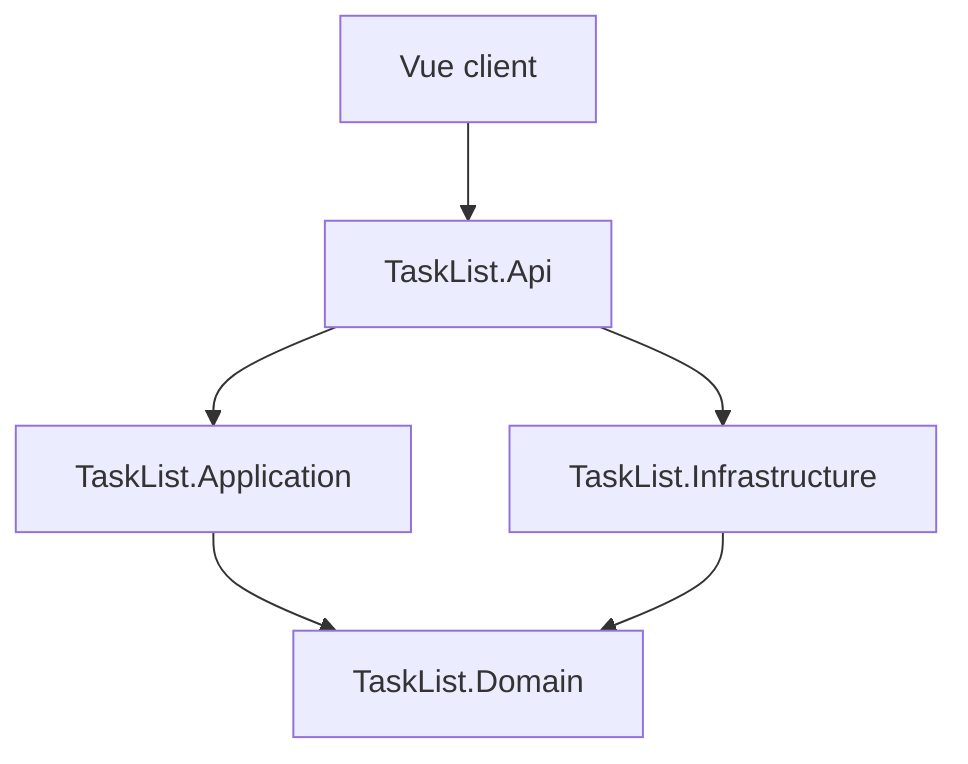

# Tasklist

A small task management application, REST API plus single-page web client.

## TL;DR

Take-home assessment for Lateral Group. The brief asked for list, create, and toggle. It invited adding missing features, so I added delete (a list you can't remove from is awkward to use). Edit was left out: the toggle model treats tasks as done/not-done items, so an edit form would mean reshaping what a task is.

Stack: .NET 10 Minimal APIs in a Clean Architecture + Vertical Slice Architecture layout, EF Core 10 over SQLite. The frontend is Vue 3 with Pinia, vee-validate + zod, and TailwindCSS 4. REST level 3 with HATEOAS links, RFC 7807 ProblemDetails for errors. Optimistic UI for toggle and delete: snapshot, mutate, restore on failure.

41 backend tests and 36 frontend tests, green on a clean clone.

## Tech stack

- **Runtime**: .NET 10, C# 14, Node.js 24 LTS
- **API**: ASP.NET Core Minimal APIs + Scalar OpenAPI viewer
- **Data**: EF Core 10 with SQLite (in-process file `tasklist.db`); a startup seeder populates a fixed set of realistic tasks on an empty database
- **Validation**: FluentValidation at the API boundary, Ardalis.GuardClauses for domain invariants
- **Cross-cutting**: Serilog structured logs, `IExceptionHandler` global error mapping, `/health/live` and `/health/ready` health probes
- **Frontend**: Vue 3.5 (`<script setup>`), Pinia, vee-validate + zod, TailwindCSS 4 with semantic tokens, class-variance-authority for Button variants, Headless UI (Dialog + Listbox), @lucide/vue icons, VueUse
- **Testing**: xUnit v3 + Shouldly + NetArchTest on the backend; Vitest + Testing Library Vue + user-event + MSW + jest-axe on the frontend

## Prerequisites

- [.NET 10 SDK 10.0.300 or newer](https://dotnet.microsoft.com/download/dotnet/10.0). Verify with `dotnet --version`.
- [Node.js 24 LTS](https://nodejs.org/). `node -v` should report `v24.x`. The frontend includes a `.nvmrc` so `nvm use` picks the right version.
- Git

## Quick start

Two terminals: one for the backend, one for the frontend.

These assume you've cloned the repo and are at the project root.

**Terminal 1, backend:**

```bash
dotnet run --project src/TaskList.Api
```

Wait for the log line confirming the API is listening on `http://localhost:5113`. Migrations and the seeder run automatically on startup, so the database is created and populated on first launch.

**Terminal 2, frontend:**

```bash
cd frontend
npm ci
npm run dev
```

The dev server starts on `http://localhost:5173` and forwards the app's API calls to the backend, so the frontend needs no CORS setup in development.

**Verify it works:**

1. Open `http://localhost:5173` in your browser. The list shows the seeded tasks.
2. Open `http://localhost:5113/scalar/v1` for interactive API documentation with every endpoint.
3. Create a task in the UI, toggle it, and delete it. All three actions should round-trip successfully.

## Running from an IDE

The two halves of the stack run in different tools. Pick the workflow that matches your editor.

**Backend.** Visual Studio 2022/2026, Rider, or VS Code:

- Open `TaskList.slnx` at the repository root (`.slnx` is the modern XML solution format and is supported by all three IDEs).
- Set `TaskList.Api` as the startup project and press F5 (Run/Debug).
- Migrations and the seeder run automatically on startup via a hosted service (`DatabaseMigrationService`), which the host awaits before the API begins serving. The SQLite file is created and populated on first launch.

**Frontend.** Vue does not run inside Visual Studio. Use VS Code (or any editor) plus a terminal:

```bash
cd frontend
npm ci
npm run dev
```

Rider users can drive the same scripts from the npm tool window. The frontend is a separate Vite dev server on `http://localhost:5173` that forwards the app's API calls to the backend on `http://localhost:5113`; both processes must be running for the full app to work.

## How to run tests

Backend, from the repository root:

```bash
dotnet test
```

Expected: **41 tests passing** across three projects.

- `TaskList.UnitTests`: domain entity invariants on `TaskItem` and `Result<T>` contracts. Pure logic, no I/O.
- `TaskList.IntegrationTests`: handler tests against real SQLite in-memory under `Handlers/`, endpoint tests through `WebApplicationFactory<Program>` under `Endpoints/`. Covers the duplicate-title 409 path at both layers.
- `TaskList.ArchitectureTests`: dependency direction (Domain has no inward edges), naming conventions (`Handler` / `Endpoint` / `Validator` suffixes), HATEOAS response shape (every response DTO exposes a `Links` property typed `IReadOnlyList<LinkResponse>`).

Frontend, from `frontend/`:

```bash
npm run test:unit
```

Expected: **36 tests passing** across six files.

- `tests/stores/tasks.store.spec.ts` (12): load/toggle/delete optimistic outcomes, error rollback, search filter, four sort options, the 409-duplicate `field-error` outcome shape.
- `tests/components/CreateTaskForm.spec.ts` (7): submit-then-live validation timing, server 422 inline mapping, server 409 inline + input preservation, the char counter warning state past 180.
- `tests/components/Toast.spec.ts` (5): semantic `role="status"` / `role="alert"`, hover-pauses-auto-dismiss with fake rAF, click-to-dismiss, and the race test that proves the rAF loop survives `create → dismiss → create`.
- `tests/components/TaskList.spec.ts` (5): the four view-state branches (loading, error, empty, success) plus one jest-axe pass over the integrated tree.
- `tests/components/ConfirmDeleteModal.spec.ts` (4): dialog renders with the task title, Delete emits `confirm`, Cancel emits `cancel`-only, Escape emits `cancel`-only.
- `tests/components/TaskItem.spec.ts` (3): event emission, HATEOAS-driven disabling, modal-confirm round-trip.

## API documentation

- **Scalar UI**: <http://localhost:5113/scalar/v1>
- **OpenAPI document**: <http://localhost:5113/openapi/v1.json>

Task endpoints:

| Method | Route | Purpose |
|---|---|---|
| `POST` | `/api/v1/tasks` | Create. 201 + Location header. 422 on validation, 409 on duplicate title. |
| `GET` | `/api/v1/tasks` | List. 200 + `{ data, links }`. |
| `GET` | `/api/v1/tasks/{id}` | Read one. 200 or 404. |
| `POST` | `/api/v1/tasks/{id}/toggle` | Flip completion. 200 or 404. |
| `DELETE` | `/api/v1/tasks/{id}` | Delete. 204 or 404. |

Health endpoints (no auth, useful for orchestration probes):

| Method | Route | Returns |
|---|---|---|
| `GET` | `/health/live` | 200 if the process is alive. No dependency checks. |
| `GET` | `/health/ready` | 200 if SQLite is reachable, 503 otherwise. |

Example, create a task:

```bash
curl -X POST http://localhost:5113/api/v1/tasks \
  -H "Content-Type: application/json" \
  -d '{"title": "Buy groceries"}'
```

The response body includes a `links` array with the `self`, `toggle`, and `delete` HATEOAS relations available for that task. The frontend uses those relations to enable or disable per-row actions, so action availability is contract-driven.

## Architecture overview



The dependency direction is enforced by the project graph: Vue client to API to Application / Infrastructure to Domain. Domain has no project references of its own; Application depends only on Domain; Infrastructure depends only on Domain; the Api project composes everything. `tests/TaskList.ArchitectureTests/DependencyRulesTests.cs` asserts this structurally, so a backwards edge fails the build.

Each slice folder under `TaskList.Api/Features/Tasks/` holds the files for one use case: `{Feature}Endpoint.cs`, `{Feature}Handler.cs`, and the command/query/response records each in their own file named after the type (one type per file). `CreateTask` also has `CreateTaskValidator.cs`. The `TaskList.Application` project holds only the `ICommandHandler<,>` and `IQueryHandler<,>` abstractions; splitting handlers into a parallel application tree adds navigation cost without architectural benefit at this scope.

## Architecture decisions at a glance

| Decision | Why | Trade-off |
|---|---|---|
| EF Core direct, no Repository wrapper | `DbContext` already implements Unit of Work, and `DbSet<T>` already exposes repository semantics | Handlers query EF Core directly; swapping providers means touching them |
| Custom `ICommandHandler<,>` / `IQueryHandler<,>`, no MediatR | The contracts I need are 4 lines and Scrutor handles their registration; the real cost of dropping MediatR is the pipeline behaviours. License went commercial post-v13 | No built-in pipeline behaviours, so cross-cutting concerns would need decorators |
| Pinia store for client state | Five endpoints, no cross-route cache, no background refetch | Manual snapshot pattern for optimistic UI; would move to Vue Query past about eight endpoints |
| `Result<T>` for expected failures, exceptions for the unexpected | Validation, not-found, and conflict are normal flow, handled as return values | Every call site branches on `IsFailure` |
| Vertical Slice Architecture inside Clean Architecture | Each use case is one folder bundling its endpoint, handler, validator, and command/query/response together, so a feature reads top-to-bottom in one place | Cross-cutting changes touch several slice folders at once; acceptable at five use cases |
| No pagination, list returns all tasks | The brief domain is bounded; pagination is structural complexity that should activate on real load signals | Documented migration path in "What I would do with more time" |

## Key decisions and trade-offs

- **REST level 3 with HATEOAS.** Level 3 is what Roy Fielding's dissertation calls truly RESTful. The marginal cost was small: `LinkGenerator` is built into ASP.NET Core, `.WithName()` was already needed for OpenAPI metadata, and the Vue client reads `task.links` to enable or disable per-row actions, so action availability is driven by the response contract. Trade-off: a few extra bytes per task on the wire, and the client checks for the relevant link before rendering an action.
- **Clean Architecture + VSA.** Four projects make the dependency rule structural: `Domain` can't reference EF Core because the EF Core package is not in its csproj. Architecture tests assert the same rule at the assembly boundary, so a backwards edge fails the build. Command and query handlers are auto-registered at the Api assembly by Scrutor (`FromAssemblyOf<Program>`, `AsImplementedInterfaces`, scoped lifetime to match `AppDbContext`), so adding a slice means dropping in a new handler class with no DI changes. The cost is more files. Worth it for the structural guarantee.
- **Pinia store for client state.** Five endpoints, no cross-route cache, no background refetch. The store snapshots the tasks array before each mutation, applies the change locally, and either accepts the server response or restores the snapshot on failure. `pendingIds` gates the affected row visually while the request is in flight. The pattern starts repeating past about eight endpoints, at which point Vue Query becomes the right call.
- **SQLite on disk.** The brief listed "EF Core in memory" as an accepted store for the app; I went with a SQLite file. Data survives a restart, migrations run on every boot, and the behaviour matches a real relational database. The trade-off is a migration step and a file on disk, both handled by the startup hosted service and an empty-database check in the seeder.
- **Scalar plus built-in health checks.** Scalar serves the OpenAPI contract as a browsable UI at `/scalar/v1` in one lightweight package. `/health/live` and `/health/ready` are built-in ASP.NET Core. Trade-off: one dependency, two routes.

## Project structure

```
TaskList.slnx
src/
  TaskList.Api/                       Minimal APIs, Scalar UI, composition root
    Program.cs                        Builds the host, adds services, configures the pipeline, runs
    Common/
      Endpoints/                      IEndpointGroup + auto-discovery extension
      ExceptionHandling/              GlobalExceptionHandler (IExceptionHandler)
      Extensions/                     ServiceCollectionExtensions, WebApplicationExtensions, ResultExtensions
      Hosting/                        DatabaseMigrationService (IHostedService that runs MigrateAsync)
      Routes.cs, RouteNames.cs        Centralised route constants
    Features/Tasks/
      CreateTask/                     CreateTaskCommand, CreateTaskEndpoint, CreateTaskHandler, CreateTaskValidator
      ListTasks/                      ListTasksQuery, ListTasksResponse, ListTasksEndpoint, ListTasksHandler
      GetTaskById/                    GetTaskByIdQuery, GetTaskByIdEndpoint, GetTaskByIdHandler
      ToggleTask/                     ToggleTaskCommand, ToggleTaskEndpoint, ToggleTaskHandler
      DeleteTask/                     DeleteTaskCommand, DeleteTaskEndpoint, DeleteTaskHandler
      Hateoas/                        LinkResponse, TaskResponse, TaskLinks (URL builder)
  TaskList.Application/               ICommandHandler<,> and IQueryHandler<,> abstractions
  TaskList.Domain/                    Entities, Result<T>, DomainError, ErrorType, strongly typed TaskId
  TaskList.Infrastructure/            AppDbContext, EF configurations, migrations, fixed-list TaskSeeder
tests/
  TaskList.UnitTests/Domain/          Pure-logic tests against the Domain project only
  TaskList.IntegrationTests/
    Handlers/                         Handler tests against real SQLite in-memory
    Endpoints/                        WebApplicationFactory<Program> HTTP exercises
    Fixtures/                         TestDb, TaskFaker (Bogus-backed), TaskApiFactory
  TaskList.ArchitectureTests/         NetArchTest rules: dependency direction, naming, response shape
frontend/
  src/
    features/tasks/                   Components, composables, store, schemas, types (vertical slice)
    shared/ui/                        Button (CVA), Input, Checkbox, Toast, FieldError
    shared/lib/                       cn, api-client, problem-details parser
    composables/                      useToast, useTheme
    App.vue, main.ts, styles.css      Root, mount, semantic tokens + dark theme
  tests/                              Vitest + Testing Library Vue + MSW + jest-axe
```

## Troubleshooting

**Backend port already in use.** Override via the environment variable:

```bash
ASPNETCORE_URLS="http://localhost:5180" dotnet run --project src/TaskList.Api
```

Update `frontend/vite.config.ts` `server.proxy.target` to match if you do this.

**HTTPS dev certificate not trusted.** The default profile runs HTTP, so this is only relevant if you switch to the `https` launch profile:

```bash
dotnet dev-certs https --trust
```

On Linux the trust step needs additional setup. See <https://aka.ms/dev-certs-trust>.

**SQLite database file locked.** Delete `src/TaskList.Api/tasklist.db` (plus any `-shm` or `-wal` siblings) and restart the API. The migration and seeder recreate it on next boot.

**Seeded tasks differ from the documented examples after pulling.** Delete `src/TaskList.Api/tasklist.db` and restart. The seeder only runs against an empty database, so existing rows from a prior run are left as-is.

**Migrations did not run on startup.** They run automatically via a hosted service (`DatabaseMigrationService`) that the host starts before the API serves requests. If you ever need to apply them manually:

```bash
dotnet ef database update \
  --project src/TaskList.Infrastructure \
  --startup-project src/TaskList.Api
```

`dotnet-ef` is registered as a local tool. Run `dotnet tool restore` first if the command is missing.

**Wrong .NET SDK version.** `dotnet --version` must report `10.0.300` or newer. `global.json` pins the floor and rolls forward to the latest feature band. Install from <https://dotnet.microsoft.com/download/dotnet/10.0>.

**Wrong Node version.** `node -v` must report `v24.x`. With nvm or fnm installed, `cd frontend && nvm use` (or `fnm use`) picks the right one from `.nvmrc`. Without a version manager, install Node 24 LTS from <https://nodejs.org>.

## What I would do with more time

1. **Optimistic concurrency on toggle.** Today, two clients toggling the same task is last-write-wins: the second request silently overwrites the first with no conflict signal. Fix: add a `rowversion`/concurrency token column on `TaskItem`, version-check inside `ToggleTaskHandler`, and return 409 Conflict on a version mismatch so the client can re-fetch and reapply. The conflict envelope is already in place; the duplicate-title 409 path uses the same RFC 7807 shape, so the client surface for "your version is stale" is already there. The missing pieces are the token column and the version check.
2. **Observability.** OpenTelemetry tracing on the backend with the `traceId` already present in `ProblemDetails` flowing into spans, plus Sentry on the frontend for runtime errors. The hook is already there in the error envelope; what's missing is the exporter and the SDK. Out of scope for assessment, mandatory for anything that ships.
3. **Server-side pagination, search, and sort.** I left this out on purpose. The list endpoint returns all tasks today; the current contract is the un-paginated `{ data, links }`. The brief says "all tasks" and the domain (a personal task list) is bounded, dozens at the extreme, so returning everything in one `GET` is cheap and correct. Client-side-only pagination was considered and rejected: the data is already fully in memory, so paginating the display is cosmetic and adds reset-on-filter / reset-on-search / reset-on-sort edge cases for zero real performance gain. The correct migration past a few hundred tasks is server-side offset pagination (`?page=&pageSize=`), a standard response shape (`{ data, totalCount, totalPages, pageSize, currentPage }`, replacing today's `{ data, links }`), HATEOAS `first` / `prev` / `next` / `last` links, and moving search and sort server-side to match (filtering one page client-side gives wrong results). This is a planned migration; the current scope is intentional. Pagination is the kind of structural complexity that should activate on real signals like "high throughput" or "thousands of requests"; the brief says "all tasks", so YAGNI wins.
4. **Playwright end-to-end test** for the create / toggle / delete happy path against the real stack. Vitest covers component contracts; one Playwright spec closes the loop and catches integration regressions Vitest cannot see.
5. **Auth, per-user ownership, and rate limiting.** The brief scoped this out; it was a deliberate exclusion. The task list is single-tenant and anonymous. Adding identity and per-user filtering is a separate vertical that shapes routes, DbContext, and DI. Rate limiting (`Microsoft.AspNetCore.RateLimiting` per IP) is the cheap part of that vertical and would land first.
6. **Soft delete with an audit trail.** A `DeletedAt` column and a global query filter on `TaskItem`, plus a small `TaskAudit` table for the create/toggle/delete events. Useful for any product that grows past a personal demo; pure overhead for the seeded fixture set.

---

[Arthur Félix](https://www.linkedin.com/in/arthurfelix)
