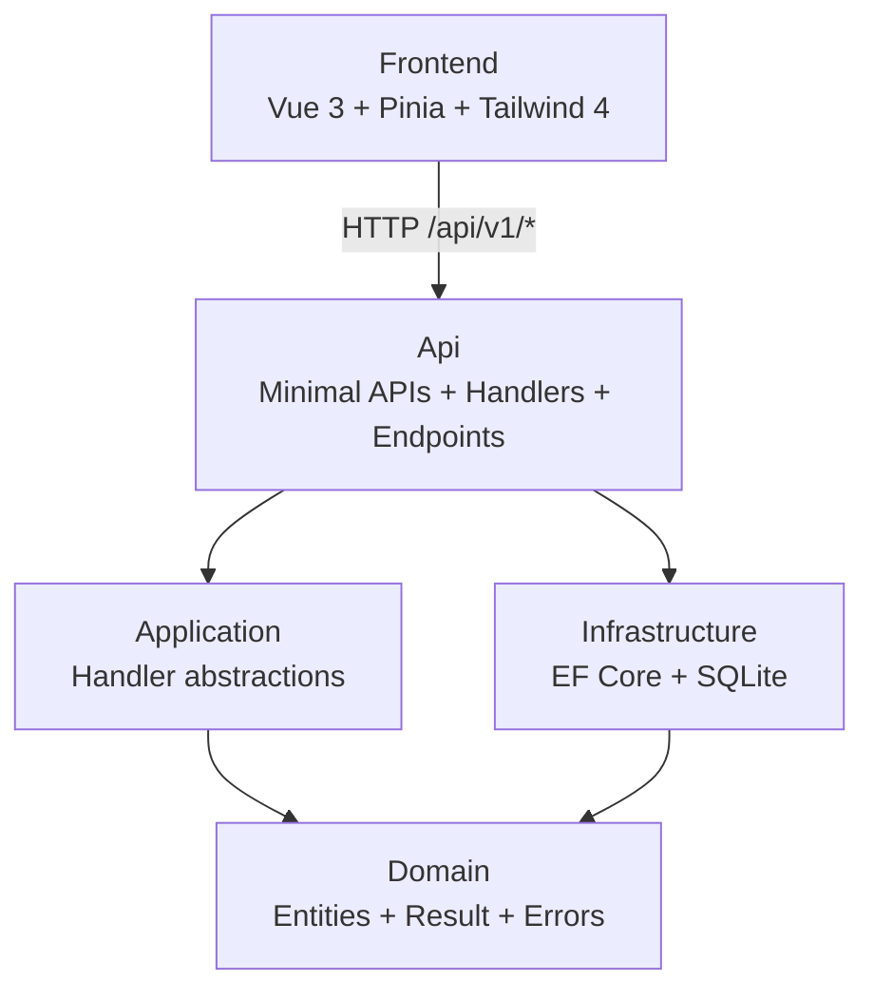

# Tasks

A small task management application, REST API plus single-page web client.

## TL;DR

Take-home assessment for Lateral Group. The brief asked for a REST API that lists, creates, toggles, and deletes tasks plus a component-based UI. I treated it as a production-quality demonstration, matching the recruiter's framing.

Stack: .NET 10 Minimal APIs over Clean Architecture + Vertical Slice Architecture, EF Core 10 against SQLite, and a Vue 3 single-page client with Pinia, vee-validate + zod, and TailwindCSS 4. REST level 3 with HATEOAS links, RFC 7807 ProblemDetails for errors, and a manual snapshot-and-restore optimistic UI for toggle and delete.

39 backend tests (domain unit, handler integration, full-stack endpoint, architecture) and 18 frontend tests (form rules, store rollback semantics, container view-state machine) all pass on a clean clone.

## Tech stack

- **Runtime**: .NET 10, C# 14, Node.js 24 LTS
- **API**: ASP.NET Core Minimal APIs + Scalar OpenAPI viewer
- **Data**: EF Core 10 with SQLite (in-process file `tasklist.db`), Bogus seeder
- **Validation**: FluentValidation at the API boundary, Ardalis.GuardClauses for domain invariants
- **Cross-cutting**: Serilog structured logs, `IExceptionHandler` global error mapping, health endpoints
- **Frontend**: Vue 3.5 (`<script setup>`), Pinia, vee-validate + zod, TailwindCSS 4 with semantic tokens, class-variance-authority for Button variants, VueUse, vue-axe in dev
- **Testing**: xUnit v3 + Shouldly + NetArchTest on the backend; Vitest + Testing Library Vue + user-event + MSW + jest-axe on the frontend

## Prerequisites

- [.NET 10 SDK 10.0.300 or newer](https://dotnet.microsoft.com/download/dotnet/10.0). Verify with `dotnet --version`.
- [Node.js 24 LTS](https://nodejs.org/). `node -v` should report `v24.x`. The frontend includes a `.nvmrc` so `nvm use` picks the right version.
- Git

## Quick start

You will need two terminals, one for the backend and one for the frontend.

**Terminal 1, backend:**

```bash
git clone <repo-url> tasks
cd tasks
dotnet run --project src/TaskList.Api
```

Wait for the log line confirming the API is listening on `http://localhost:5113`. Migrations and a seeder run automatically on startup, so the database starts with 10 example tasks.

**Terminal 2, frontend:**

```bash
cd frontend
npm ci
npm run dev
```

The dev server starts on `http://localhost:5173` and proxies `/api/*` to the backend, so no CORS configuration is needed in development.

**Verify it works:**

1. Open `http://localhost:5173` in your browser. The list should show 10 seeded tasks.
2. Open `http://localhost:5113/scalar/v1` for interactive API documentation with every endpoint.
3. Create a task in the UI, toggle it, and delete it. All three actions should round-trip successfully.

## How to run tests

Backend, from the repository root:

```bash
dotnet test
```

Expected: **39 tests passing** across three projects. `TaskList.UnitTests` covers 13 cases against the Domain project only. `TaskList.IntegrationTests` covers 17 cases: handlers run against SQLite in-memory and endpoints run through `WebApplicationFactory`. `TaskList.ArchitectureTests` covers 9 cases for dependency direction, naming conventions, and HATEOAS response shape. Wall time under 10 seconds after the first run.

Frontend, from `frontend/`:

```bash
npm run test:unit
```

Expected: **18 tests passing** across four files. `tests/components/CreateTaskForm.spec.ts` has 4 tests for form rules and server-driven 422 mapping. `tests/components/TaskItem.spec.ts` has 3 for event emission and HATEOAS-aware disabling. `tests/components/TaskList.spec.ts` has 5 for the view-state machine plus the integrated a11y check. `tests/stores/tasks.store.spec.ts` has 6 for optimistic toggle and delete with snapshot rollback.

## API documentation

- **Scalar UI**: <http://localhost:5113/scalar/v1>
- **OpenAPI document**: <http://localhost:5113/openapi/v1.json>
- **HTTP request file**: [`src/TaskList.Api/TaskList.Api.http`](src/TaskList.Api/TaskList.Api.http). Open it in VS Code or Rider's REST client for one-click execution of every endpoint plus the 422 and 404 paths.

Example, create a task:

```bash
curl -X POST http://localhost:5113/api/v1/tasks \
  -H "Content-Type: application/json" \
  -d '{"title": "Buy groceries"}'
```

The response body includes a `links` array with the `self`, `toggle`, and `delete` HATEOAS relations available for that task.

## Architecture overview



The dependency rule lives in the project graph: every arrow points inward toward `Domain`, and the `Domain` project has no project references of its own. `tests/TaskList.ArchitectureTests/DependencyRulesTests.cs` asserts the rule structurally, so a contributor cannot accidentally introduce a backwards edge without the build failing.

Handlers and endpoints live together inside `TaskList.Api/Features/` as vertical slices, one folder per use case with `Endpoint.cs`, `Handler.cs`, `Validator.cs`, and `Models.cs`. The `Application` project holds only the `ICommandHandler<,>` and `IQueryHandler<,>` abstractions. Splitting handlers into a parallel tree under the Application project adds navigation cost without architectural benefit at this scope.

## Key decisions and trade-offs

- **REST level 3 with HATEOAS, not just level 2.** The brief asked for production-quality work. Level 3 is what Roy Fielding's dissertation calls truly RESTful; earlier levels are HTTP-shaped RPC. The marginal cost was small: `LinkGenerator` is built into ASP.NET Core, `.WithName()` was already mandatory for OpenAPI metadata, and `TaskItem.vue` reads `task.links` to enable or disable actions, so action availability is contract-driven instead of hard-coded. Trade-off: payload size grows by a few bytes per task, and the client wraps every action button in a links check.
- **Clean Architecture + VSA, not VSA-only.** The four projects make the dependency rule structural: `Domain` cannot reference EF Core because the package is not in its csproj. The extra file count is the price for architecture tests that enforce dependency direction at the assembly boundary.
- **Pinia store, not Vue Query, for server state.** With three endpoints, no cross-route cache, and no background refetch needs, Vue Query would add a library for state I do not need at this scope. The store uses a manual snapshot pattern: before each mutation it captures the current tasks array, applies the change locally, calls the API, then either replaces the entry with the server response on success or restores the snapshot on failure. What I gave up: when the API grows to six or more endpoints, this pattern starts repeating and Vue Query becomes the right call.
- **Container test over leaf tests.** `TaskList.spec.ts` drives the four view-state branches (loading, error, empty, success) by setting Pinia initial state and asserting the right child renders, with one jest-axe call on the integrated tree. There is no `EmptyState.spec.ts` or `LoadingState.spec.ts` because those components are pure presentation and have no behavior worth testing in isolation. I deliberately skipped tests for pure presentation components and generic library wrappers because they add maintenance cost without catching real bugs. Trade-off: lower per-file line coverage on the leaves, accepted because the leaves have no branches to cover.
- **Semantic CSS tokens, not raw Tailwind shades.** Components reference `bg-surface`, `text-foreground`, `border-border` instead of `bg-slate-900`. The mapping lives in a single `@theme` block in `src/styles.css`, with a `.dark` override layer. Adding a brand color or flipping the palette is one diff in one file. The cost: contributors editing styles need to learn the token map before changing colors.

## Project structure

```
TaskList.slnx
src/
  TaskList.Api/                     Minimal APIs, Scalar UI, Program.cs, middleware
    Features/Tasks/{CreateTask,ListTasks,GetTaskById,ToggleTask,DeleteTask}/
                                    One folder per use case: Endpoint, Handler, Validator, Models
    Features/Tasks/Mapping/         LinkResponse + TaskResponse + TaskLinks builder
    Common/                         Routes, RouteNames, GlobalExceptionHandler, ResultExtensions
    TaskList.Api.http               Request manifest for every endpoint
  TaskList.Application/             ICommandHandler<,> and IQueryHandler<,> abstractions
  TaskList.Domain/                  Entities, Result<T>, DomainError, ErrorType, strongly typed TaskId
  TaskList.Infrastructure/          AppDbContext, EF configurations, migrations, Bogus seeder
tests/
  TaskList.UnitTests/Domain/        Pure-logic tests against the Domain project only
  TaskList.IntegrationTests/
    Features/                       Handler tests against real SQLite in-memory
    Endpoints/                      WebApplicationFactory<Program> HTTP exercises
    Fixtures/                       TestDb, TaskFaker, TaskApiFactory
  TaskList.ArchitectureTests/       NetArchTest rules: dependency direction, naming, response shape
frontend/
  src/
    features/tasks/                 Components, composables, store, schemas, types (vertical slice)
    shared/ui/                      Button (CVA), Input, Checkbox, Spinner, Toast
    shared/lib/                     cn, api-client, problem-details parser
    composables/                    useToast, useTheme
    App.vue, main.ts, styles.css    Root, mount, semantic tokens + dark theme
  tests/                            Vitest + Testing Library Vue + MSW + jest-axe
```

## Troubleshooting

**Backend port already in use.** Override via the environment variable:

```bash
ASPNETCORE_URLS="http://localhost:5180" dotnet run --project src/TaskList.Api
```

Update `frontend/vite.config.ts` `server.proxy.target` to match if you do this.

**HTTPS dev certificate not trusted.** The default profile runs HTTP, so this is only relevant if you switch to the `https` launch profile:

```bash
dotnet dev-certs https --trust
```

On Linux the trust step needs additional setup. See <https://aka.ms/dev-certs-trust>.

**SQLite database file locked.** Delete `src/TaskList.Api/tasklist.db` (plus any `-shm` or `-wal` siblings) and restart the API. The migration and seeder recreate it on next boot.

**Migrations did not run on startup.** They run inside `Program.cs` via `MigrateAsync`. If you ever need to apply them manually:

```bash
dotnet ef database update \
  --project src/TaskList.Infrastructure \
  --startup-project src/TaskList.Api
```

`dotnet-ef` is registered as a local tool. Run `dotnet tool restore` first if the command is missing.

**Wrong .NET SDK version.** `dotnet --version` must report `10.0.300` or newer. `global.json` pins the floor and rolls forward to the latest feature band. Install from <https://dotnet.microsoft.com/download/dotnet/10.0>.

**Wrong Node version.** `node -v` must report `v24.x`. With nvm or fnm installed, `cd frontend && nvm use` (or `fnm use`) picks the right one from `.nvmrc`. Without a version manager, install Node 24 LTS from <https://nodejs.org>.

## What I would do with more time

1. **Playwright end-to-end test** for the create, toggle, delete happy path against the real stack. Vitest covers component contracts; one Playwright spec closes the loop and catches integration regressions Vitest cannot see.
2. **CI pipeline** as a GitHub Actions workflow: `dotnet format --verify-no-changes`, `dotnet test`, `npm ci && npm run build && npm run test:unit`, plus axe-playwright on a smoke flow. Today these run locally; in a team setting they belong on every push.
3. **Telemetry**: OpenTelemetry tracing on the backend with the `traceId` already present in ProblemDetails flowing into spans, plus Sentry on the frontend for runtime errors. Out of scope for assessment, mandatory for anything that ships.
4. **Container image and docker-compose** so a reviewer can run the entire stack with `docker compose up`. Today the two-terminal workflow is fine; for cross-platform demos a single command is friendlier.

---

Arthur Félix · https://linkedin.com/in/arthurfelix
